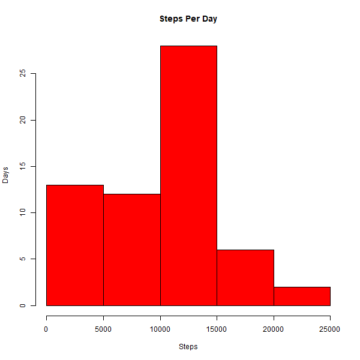
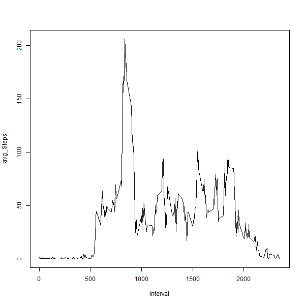
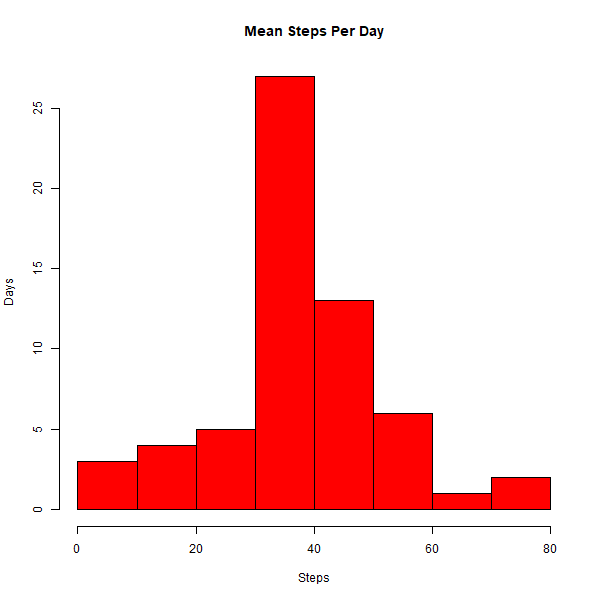
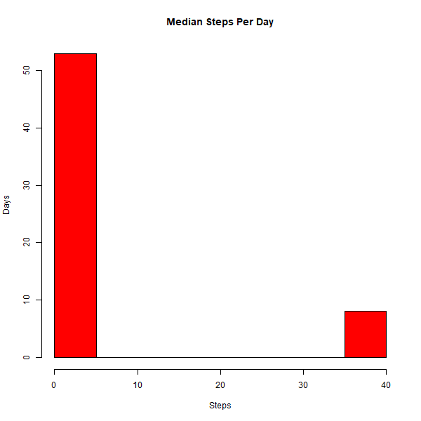
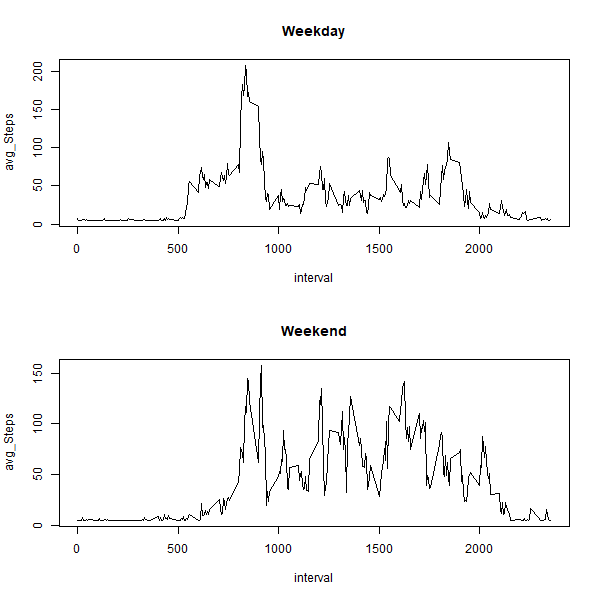

#Loading and preprocessing the data


```r
dat <- read.csv('./data/activity.csv', sep  = "," )
summary(dat)
```

```
##      steps                date          interval     
##  Min.   :  0.00   2012-10-01:  288   Min.   :   0.0  
##  1st Qu.:  0.00   2012-10-02:  288   1st Qu.: 588.8  
##  Median :  0.00   2012-10-03:  288   Median :1177.5  
##  Mean   : 37.38   2012-10-04:  288   Mean   :1177.5  
##  3rd Qu.: 12.00   2012-10-05:  288   3rd Qu.:1766.2  
##  Max.   :806.00   2012-10-06:  288   Max.   :2355.0  
##  NA's   :2304     (Other)   :15840
```

#What is mean total number of steps taken per day?

Total step for every day


```r
dat1 <- aggregate(dat$steps, by = list(dat$date), FUN = sum, na.rm = TRUE)
names(dat1) <- c('date', 'totalsteps')
head(dat1, 3)
```

```
##         date totalsteps
## 1 2012-10-01          0
## 2 2012-10-02        126
## 3 2012-10-03      11352
```

Histogram of total number of steps taken per day


```r
hist(dat1$totalsteps,
     main = "Steps Per Day",
     xlab = "Steps",
     ylab = "Days",
     col = "red")
```



Mean and Median steps per day


```r
median(dat1$totalsteps)
```

```
## [1] 10395
```

```r
mean(dat1$totalsteps)
```

```
## [1] 9354.23
```

#What is the average daily activity pattern?

Average step for every 5 minute interval


```r
dat2 <- aggregate(dat$steps, by = list(dat$interval), FUN = mean, na.rm = TRUE)
names(dat2) <- c('interval', 'avg_steps')
head(dat2,3)
```

```
##   interval avg_steps
## 1        0 1.7169811
## 2        5 0.3396226
## 3       10 0.1320755
```

Plot of average daily activity pattern


```r
plot(dat2$interval, dat2$avg_steps, type = "l", xlab = 'interval', ylab = "avg_Steps")
```



5 Min interval with maximum steps


```r
dat2[which.max(dat2$avg_steps),]
```

```
##     interval avg_steps
## 104      835  206.1698
```


#Imputing missing values

Total # of NA in each column


```r
sapply(dat, function(y) sum(is.na(y)))
```

```
##    steps     date interval 
##     2304        0        0
```

New dataset where steps with value NA is replaced by the 5 min mean across all observations


```r
datf <- dat
datf$steps[is.na(datf$steps)] <- mean(dat$steps,na.rm= TRUE)
sapply(datf, function(y) sum(is.na(y)))
```

```
##    steps     date interval 
##        0        0        0
```

```r
head(datf,3)
```

```
##     steps       date interval
## 1 37.3826 2012-10-01        0
## 2 37.3826 2012-10-01        5
## 3 37.3826 2012-10-01       10
```

Create 2 datasets, 1 aggregate by mean and 1 aggregate by median 


```r
datf1 <- aggregate(datf$steps, by = list(datf$date), FUN = mean, na.rm = TRUE)
names(datf1) <- c('day', 'mean_steps')
head(datf1)
```

```
##          day mean_steps
## 1 2012-10-01   37.38260
## 2 2012-10-02    0.43750
## 3 2012-10-03   39.41667
## 4 2012-10-04   42.06944
## 5 2012-10-05   46.15972
## 6 2012-10-06   53.54167
```

```r
datf2 <- aggregate(datf$steps, by = list(datf$date), FUN = median, na.rm = TRUE)
names(datf2) <- c('day', 'median_Steps')
head(datf2)
```

```
##          day median_Steps
## 1 2012-10-01      37.3826
## 2 2012-10-02       0.0000
## 3 2012-10-03       0.0000
## 4 2012-10-04       0.0000
## 5 2012-10-05       0.0000
## 6 2012-10-06       0.0000
```

Histogram for mean total steps per day


```r
hist(datf1$mean_steps,
         main = "Mean Steps Per Day",
         xlab = "Steps",
         ylab = "Days",
         col = "red")
```



Histogram for median total steps per day


```r
hist(datf2$median_Steps,
         main = "Median Steps Per Day",
         xlab = "Steps",
         ylab = "Days",
         col = "red")
```



Mean and median are both increased with additional inputs


```r
datf <- aggregate(datf$steps, by = list(datf$date), FUN = sum, na.rm = TRUE)
names(datf) <- c('date', 'totalsteps')
median(datf$totalsteps)
```

```
## [1] 10766.19
```

```r
mean(datf$totalsteps)
```

```
## [1] 10766.19
```

#Are there differences in activity patterns between weekdays and weekends?

Revalue each date as "weekend" or "weekday"


```r
library(plyr)
datf <- dat
datf$steps[is.na(datf$steps)] <- mean(dat$steps,na.rm= TRUE)

datf$date <- weekdays(as.Date(datf$date))
datf$date <- revalue(datf$date, c("Saturday" = "weekend"))
datf$date <- revalue(datf$date, c("Sunday" = "weekend"))
datf$date <- revalue(datf$date, c("Monday" = "weekday"))
datf$date <- revalue(datf$date, c("Tuesday" = "weekday"))
datf$date <- revalue(datf$date, c("Wednesday" = "weekday"))
datf$date <- revalue(datf$date, c("Thursday" = "weekday"))
datf$date <- revalue(datf$date, c("Friday" = "weekday"))
head(datf)
```

```
##     steps    date interval
## 1 37.3826 weekday        0
## 2 37.3826 weekday        5
## 3 37.3826 weekday       10
## 4 37.3826 weekday       15
## 5 37.3826 weekday       20
## 6 37.3826 weekday       25
```

Create 2 plots with average steps taken across weekday and weekend

```r
datwkday <- subset(datf, date == "weekday")
datwkday <- aggregate(datwkday$steps, by = list(datwkday$interval), FUN = mean, na.rm = TRUE)
names(datwkday) <- c("interval","mean_steps")

datwkend <- subset(datf, date == "weekend")
datwkend <- aggregate(datwkend$steps, by = list(datwkend$interval), FUN = mean, na.rm = TRUE)
names(datwkend) <- c("interval","mean_steps")

par(mfrow=c(2, 1))
plot(datwkday$interval, datwkday$mean_steps, type = "l", xlab = 'interval', ylab = "avg_Steps", main = 'Weekday')
plot(datwkend$interval, datwkend$mean_steps, type = "l", xlab = 'interval', ylab = "avg_Steps", main = 'Weekend')
```


